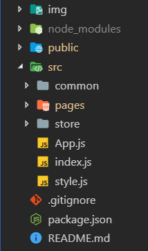

# React 建PC端简书首页的前端项目

这个项目从2019年四月开始做的，经过一个多月才陆陆续续完成。因为是第一次写那么大的项目，而且对于react掌握程度有限，因此完成周期比较长。不过在实现途中收获了很多，比如在实现某些动画效果时，简单使用了 `CSStransition` ，写 UI 组件直接使用了 `styled-components` ，把 CSS 样式成为 React 的一个UI组件；代码优化时，使用 `PureComponent` 来代替使用 `componentShouldUpdata` 生命周期函数，最后还用到了 `react-router-dom` 提升页面体验，而且模拟了许多接口API，如：推荐信息、推荐用户、内容列表等。项目最重要的是使用 **`act + Redux`** 构建应用。redux 出色的状态管理使编写react变得简单并且容易管理。

构建应用途中，大致使用了如下一些模块：

| 模块名称                     | 描述                       |
| ------------------------ | ------------------------ |
| `react`                  | 基础模块                     |
| `react-redux`            | 更好的管理react状态             |
| `react-router-dom`       | react 前端路由               |
| `redux-thunk`            | 更好的管理异步请求                |
| `redux-immutable`        | 用于数据管理                   |
| `styled-components`      | 一个适合 react 的 CSS in JS 库 |
| `react-transition-group` | 在react应用中可以更加方便实现动画效果    |
| `axios`                  | 用于异步请求的库                 |

初始构建项目时，直接使用了 `create-react-app` ，减少了配置的繁琐。

项目目录：

目录说明：

## 项目搭建思路

#### `create-react-app jianshu_demo`

通过脚手架工具创建完基本骨架后，删除不需要的文件。比如初始的react页面内容以及测试文件。

#### `yarn start`

运行项目，查看页面效果。
