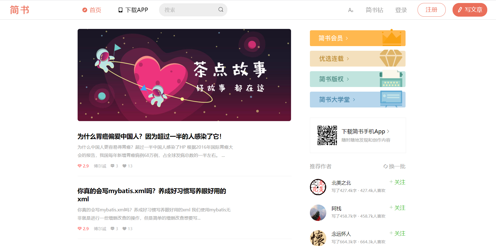
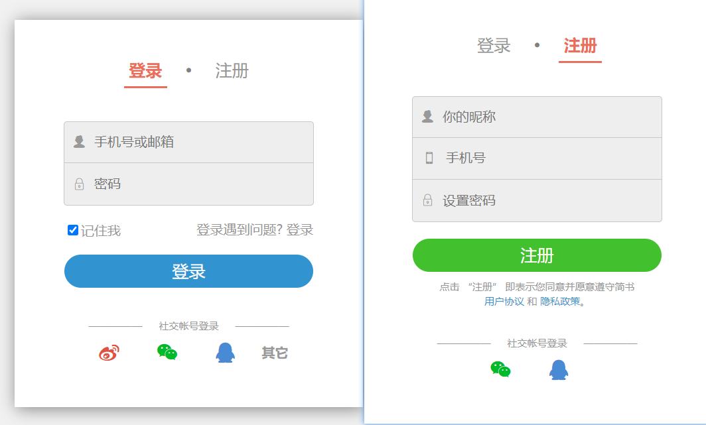

# React 构建 PC 端简书首页的前端项目

## 启动

```
npm install
```

```
npm run start
```

## 预览

纯前端页面，只是完成了页面的布局，mock 数据，这些数据存放于 /public/api 下。  

  



## 技术栈

- 使用 redux 管理状态；
- 使用 styled-components 处理样式；
- 使用 react-router 控制路由；
- 使用 react-transition-group 实现动画过渡效果；


